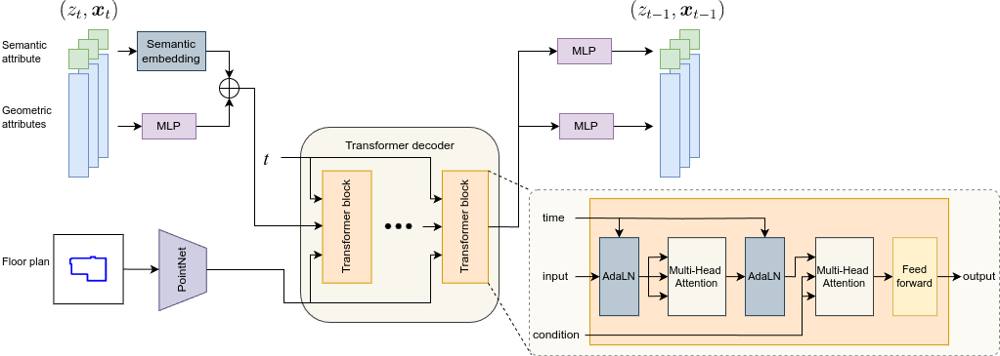

# Mixed Diffusion Models for 3D Indoor Scene Synthesis
This repository contains the model code that accompanies our paper [Mixed Diffusion for 3D Indoor Scene Synthesis](https://arxiv.org/abs/2405.21066).
We present **MiDiffusion**, a novel mixed discrete-continuous diffusion model architecture, designed to synthesize plausible 3D indoor scenes from given room types, floor plans, and potentially pre-existing objects. Our approach uniquely implements structured corruption across the mixed discrete semantic and continuous geometric domains, resulting in a better conditioned problem for the reverse denoising step. 



We place the preprocessing and evaluation scripts for the [3D-FRONT](https://tianchi.aliyun.com/specials/promotion/alibaba-3d-scene-dataset) and [3D-FUTURE](https://tianchi.aliyun.com/specials/promotion/alibaba-3d-future) datasets based on [ATISS](https://github.com/nv-tlabs/ATISS/) in our [ThreedFront dataset](https://github.com/MIT-SPARK/ThreedFront) repository to facilitate comparisons with other 3D scene synthesis methods using the same datasets.
ThreedFront also contains dataset class implementations as a standalone `threed_front` package, which is a dependency of this repository.
We borrow code from [VQ-Diffusion](https://github.com/microsoft/VQ-Diffusion) and [DiffuScene](https://github.com/tangjiapeng/DiffuScene) for discrete and continuous domain diffusion implementations, respectively. Please refer to related licensing information in <a href="./external_licenses/">external_licenses</a>.

If you found this work useful, please consider citing our paper:
```
@article{Hu24arxiv-MiDiffusion,
  author={Siyi Hu and Diego Martin Arroyo and Stephanie Debats and Fabian Manhardt and Luca Carlone and Federico Tombari},
  title={Mixed Diffusion for 3D Indoor Scene Synthesis},
  journal = {arXiv preprint: 2405.21066},
  pdf = {https://arxiv.org/abs/2405.21066},
  Year = {2024}
}
```

## Installation & Dependencies
Our code is developed in Python 3.8 with PyTorch 1.12.1 and CUDA 11.3.

First, from this root directory, clone [ThreedFront](https://github.com/MIT-SPARK/ThreedFront):
```
git clone git@github.com:MIT-SPARK/ThreedFront.git ../ThreedFront
```
You can either install all dependencies listed in [ThreedFront](https://github.com/MIT-SPARK/ThreedFront), or, if you also want to use `threed_front` for other projects, install `threed_front` separately and add its `site-packages` directory. For example, if you use virtualenv, run
```
echo "<ThreedFront_venv_dir>/lib/python3.x/site-packages" > <MiDiffusion_venv_dir>/lib/python3.x/site-packages/threed-front.pth
```

Then install `threed_front` and `midiffusion`. `midiffusion` requires two additional dependencies: [einops==0.8.0](https://einops.rocks/) and [wandb==0.17.1](https://docs.wandb.ai/quickstart). 
```
# install threed-front
pip install -e ../ThreedFront

# install midiffusion
python setup.py build_ext --inplace
pip install -e .
```

## Dataset
We use [3D-FRONT](https://tianchi.aliyun.com/specials/promotion/alibaba-3d-scene-dataset) and [3D-FUTURE](https://tianchi.aliyun.com/specials/promotion/alibaba-3d-future) datasets for training and testing of our model.
Please follow the data preprocessing steps in [ThreedFront](https://github.com/MIT-SPARK/ThreedFront). 
We use the same data files as those included in `ThreedFront/data_files` for training and evaluation steps. Please check that `PATH_TO_DATASET_FILES` and `PATH_TO_PROCESSED_DATA` in `scripts/utils.py` are pointing to the right directories.

## Training
To train diffuscene on 3D Front-bedrooms, you can run 
```
python scripts/train_diffusion.py <path_to_config_file> --experiment_tag <experiment_name>
```
We provide example config files in the `config/` directory. This train script saves a copy of the config file (as `config.yaml`) and log intermediate model weights to `output/log/<experiment_name>` unless `--output_directory` is set otherwise.

## Experiment
The `scripts/generate_results.py` script can compute and pickle synthetic layouts generated by a trained model through the `threed_front` package. We provide example trained models [here](https://drive.google.com/drive/folders/14N87Ap90KNaDlRv5u6UeCV1h_MT9QqaN?usp=sharing).
```
python scripts/generate_results.py <path_to_model_file> --result_tag <result_name>
```
This script loads config from the `config.yaml` file in the same directory as `<path_to_model_file>` if not specified.
The results will be saved to `output/predicted_results/<result_name>/results.pkl` unless `--output_directory` is set otherwise.
We can run experiments with different object constraints using the same model by setting the `--experiment` argument. The options include:
- **synthesis** (default): scene synthesis problem given input floor plans.
- **scene_completion**: scene completion given floor plans and existing objects (specified via `--n_known_objects`).
- **furniture_arrangement**: scene completion given floor plans, object labels and sizes.
- **object_conditioned**: scene completion given floor plans, object labels.
- **scene_completion_conditioned**: scene completion given floor plans, existing objects, and labels of remaining objects.

You can then render the predicted layout to top-down projection images using `scripts/render_results.py` in [ThreedFront](https://github.com/MIT-SPARK/ThreedFront) for evaluation.
```
python ../ThreedFront/scripts/render_results.py output/predicted_results/<result_name>/results.pkl
``` 
Please read this script for rendering options.

## Evaluation
The evaluation scripts in the `scripts/` directory of [ThreedFront](https://github.com/MIT-SPARK/ThreedFront) include:
- `evaluate_kl_divergence_object_category.py`: Compute **KL-divergence** between ground-truth and synthesized object category distributions.
- `compute_fid_scores.py`: Compute average **FID** or **KID** (if run with "--compute_kid" flag) between ground-truth and synthesized layout images.
- `synthetic_vs_real_classifier.py`: Train image classifier to distinguish real and synthetic projection images, and compute average **classification accuracy**.
- `bbox_analysis.py`: Count the number of **out-of-boundary** object bounding boxes and compute pairwise bounding boxes **IoU** (this requires sampled floor plan boundary and normal points).

## Video
An overview of MiDiffusion is available on [YouTube](https://www.youtube.com/watch?v=sLOMhsweb8Y):

[](https://www.youtube.com/watch?v=sLOMhsweb8Y)


## Relevant Research

Please also check out the following papers that explore similar ideas:
- Fast and Flexible Indoor Scene Synthesis via Deep Convolutional Generative Models [pdf](https://arxiv.org/pdf/1811.12463.pdf)
- Sceneformer: Indoor Scene Generation with Transformers [pdf](https://arxiv.org/pdf/2012.09793.pdf)
- ATISS: Autoregressive Transformers for Indoor Scene Synthesis [pdf](https://arxiv.org/pdf/2110.03675.pdf)
- Indoor Scene Generation from a Collection of Semantic-Segmented Depth Images [pdf](https://arxiv.org/abs/2108.09022)
- Scene Synthesis via Uncertainty-Driven Attribute Synchronization [pdf](https://arxiv.org/abs/2108.13499)
- LEGO-Net: Learning Regular Rearrangements of Objects in Rooms [pdf](https://arxiv.org/abs/2301.09629)
- DiffuScene: Denoising Diffusion Models for Generative Indoor Scene Synthesis [pdf](https://arxiv.org/abs/2303.14207)
